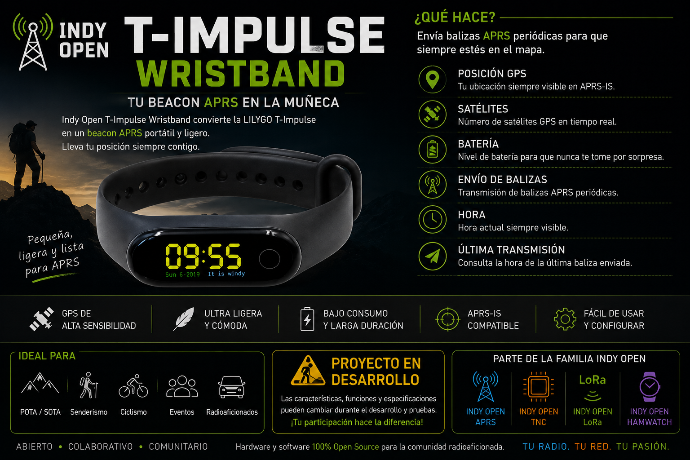

# ⌚📡 Indy Open T-Impulse Wristband

## Tu beacon APRS en la muñeca.

**Indy Open T-Impulse Wristband** es un proyecto abierto de la familia
**Indy Open**, orientado a convertir la **LILYGO T-Impulse** en un
beacon APRS portátil, ligero y configurable.

El proyecto aprovecha el **STM32L073RZ**, el posicionamiento GNSS y la
radio **LoRa** para transmitir balizas APRS y mostrar en la muñeca
información útil como hora, satélites, batería y estado de transmisión.

> \[!IMPORTANT\]\
> ## 🚧EL PROYECTO ESTA EN CONTINUO DESARROLLO
>
> Si quieres seguir la evolución del proyecto, utiliza ⭐ **Star** y 👀
> **Watch** en GitHub para recibir las próximas actualizaciones.

# WEBFLASHER - Indy Open T-Impulse Wristband
# https://xe3jac.github.io/Indy-Open-T-Impulse-Wristband/webflasher

Desde el Web Flasher puedes seleccionar el perfil de radio, configurar
tus datos APRS y preparar el firmware para instalarlo en la T-Impulse.

------------------------------------------------------------------------

## 🚀 ¿Qué queremos hacer?

Indy Open T-Impulse Wristband busca ofrecer un tracker APRS pequeño y
cómodo para llevar directamente en la muñeca.

Entre las funciones del proyecto se encuentran:

-   📍 Posicionamiento mediante GNSS
-   📡 Envío periódico de balizas APRS
-   🛰️ Número de satélites
-   🔋 Estado de batería
-   🕐 Hora obtenida mediante GNSS
-   ➤ Hora de la última transmisión
-   🚶 Intervalos de baliza según actividad
-   ⚙️ Configuración mediante Web Flasher
-   📻 Comunicación mediante LoRa

------------------------------------------------------------------------

## 📡 APRS

El dispositivo puede configurarse con los siguientes parámetros:

-   Indicativo APRS
-   Comentario de baliza
-   Intervalo estacionario
-   Intervalo caminando
-   Intervalo conduciendo
-   Potencia de transmisión
-   Activación o desactivación de TX

Los parámetros se personalizan desde el Web Flasher antes de instalar el
firmware.

------------------------------------------------------------------------

## 📻 Perfiles de radio

Actualmente se contemplan los siguientes perfiles:

  Módulo   Radio       Frecuencia
  -------- -------- -------------
  S78G     SX1278     433.775 MHz
  S76G     SX1276     868.200 MHz
  S76G     SX1276     915.000 MHz

> La frecuencia y potencia utilizadas deben cumplir con la normativa
> aplicable en cada país o región y con los privilegios de la licencia
> del operador.

------------------------------------------------------------------------

## 🔧 Hardware objetivo

El desarrollo está pensado para:

### LILYGO T-Impulse

Características principales utilizadas por el proyecto:

-   STM32L073RZ
-   GNSS
-   LoRa
-   Pantalla integrada
-   Funcionamiento portátil con batería
-   Conexión USB para configuración e instalación

------------------------------------------------------------------------

## ⌚ Información en pantalla

La interfaz está pensada para mostrar información relevante sin saturar
la pantalla.

Entre los datos contemplados se encuentran:

-   Hora
-   Indicativo APRS
-   Estado GNSS
-   Número de satélites
-   Nivel de batería
-   Estado de TX
-   Última baliza transmitida

------------------------------------------------------------------------

## 🥾 Ideal para

-   🏔️ POTA / SOTA
-   🥾 Senderismo
-   🚴 Ciclismo
-   👥 Eventos
-   🚗 Operación móvil
-   📻 Radioaficionados

------------------------------------------------------------------------

## ⭐ Sigue el proyecto

Si te interesa Indy Open T-Impulse Wristband:

-   ⭐ Dale una **Star** al repositorio
-   👀 Usa **Watch** para recibir actualizaciones
-   🍴 Haz **Fork** si quieres experimentar
-   💡 Comparte ideas y sugerencias
-   🐛 Reporta errores
-   🤝 Contribuye al desarrollo

Cada colaboración ayuda a que el proyecto siga creciendo.

------------------------------------------------------------------------

## ☕ Apoya el proyecto

Indy Open es un proyecto comunitario desarrollado por interés en la
radioafición, la experimentación y el hardware/software abierto.

Si quieres ayudar a continuar desarrollando, probando hardware y creando
nuevas funciones, puedes apoyar voluntariamente el proyecto.

❤️ **Las donaciones son completamente opcionales.**

**¡Gracias por apoyar Indy Open APRS! 73 de XE3JAC**
